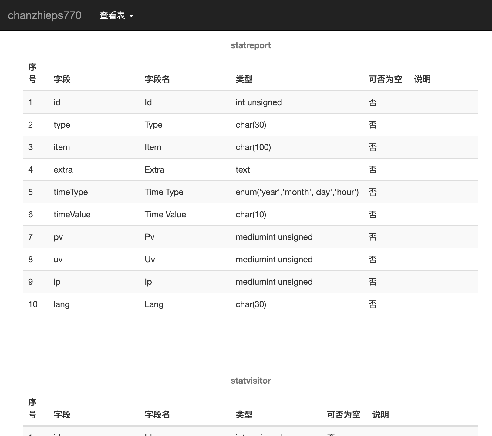

# The db dict generator

简易的数据字典文件生成工具，指定数据库连接信息，就可以一键生成数据字典文件。

## 安装

```shell

# 初始化依赖环境
composer update

```

## 使用

```shell
# 修改数据库配置文件 参照 ./tests/config.ini

php src/index.php -c ./tests/config.ini

# 运行后生成的文件在 ./temp 目录下，对应数据库名
```

## 效果图



## TODO

 * 支持更多的输出类型，比如md、Excel、PDF 等
